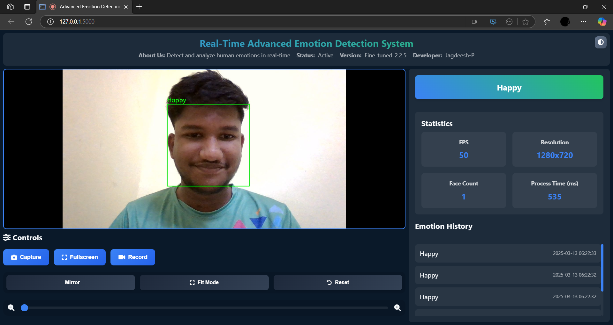

# Realtime-Emotion-Capture

A real-time emotion detection application using a deep learning model to analyze facial expressions and provide emotion statistics.

## Overview

This project utilizes a Convolutional Neural Network (CNN) model to detect emotions from video frames captured by the user's webcam. The application provides real-time feedback on the detected emotions, including statistics such as faces detected, processing time, and a history log of emotions.

## Features

- **Real-Time Emotion Detection:** Analyzes facial expressions in real-time using a trained CNN model.
- **Camera Controls:** Offers controls for mirroring, zooming, and resetting the video feed.
- **Emotion Statistics:** Displays the number of faces detected, processing time, and emotion history.
- **Dark Mode/Light Mode Toggle:** Allows users to switch between dark and light themes.

## Requirements

- **Python 3.9+**
- **Flask**
- **TensorFlow 2.x**
- **OpenCV**
- **MongoDB** (optional for data storage)
- **Webcam** (for video input)

## Setup

1. **Clone the Repository:**
   ```sh
   git clone https://github.com/your-username/Advanced-Emotion-Detection.git
   ```
2. **Install Dependencies:**
   ```sh
   pip install -r requirements.txt
   ```
3. **Start the Application:**
   ```sh
   python app.py
   ```
4. **Access the Application:**
   Open a web browser and navigate to `http://127.0.0.1:5000/`.

## Usage

1. **Camera Access:** Ensure your webcam is accessible.
2. **Emotion Detection:** The application will start detecting emotions once the camera feed is active.
3. **Controls:** Use the controls to adjust the video feed (mirror, zoom, reset).
4. **Dark/Light Mode:** Toggle between themes using the moon icon.


### **Home Page**


## Contributing

Contributions are welcome! Please submit pull requests with clear descriptions of changes.

## License

[MIT License](https://opensource.org/licenses/MIT)

## Acknowledgments

- **TensorFlow and Keras:** For providing the deep learning framework.
- **OpenCV:** For video processing capabilities.
- **Flask:** For the web application framework.

## Contact

For questions or suggestions, feel free to reach out via email or GitHub issues.
## Email: jagdeeshpersonal@gmail.com
